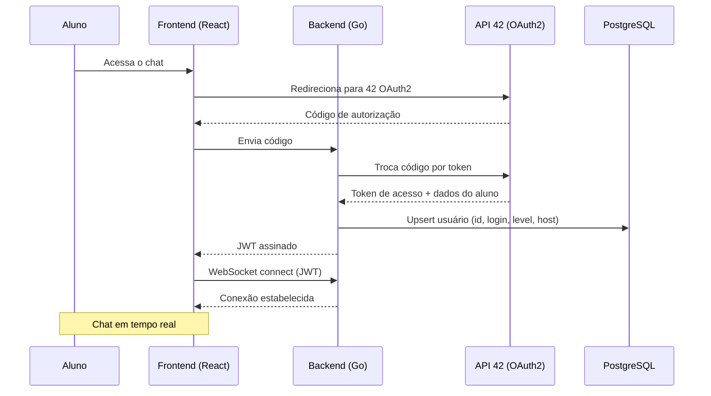
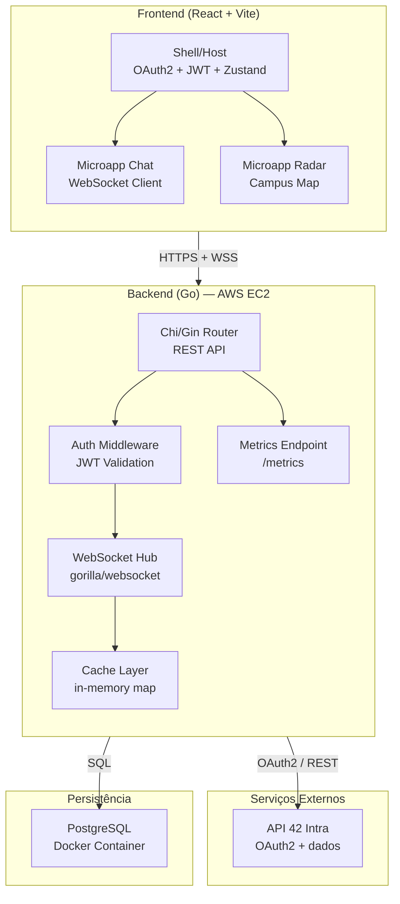
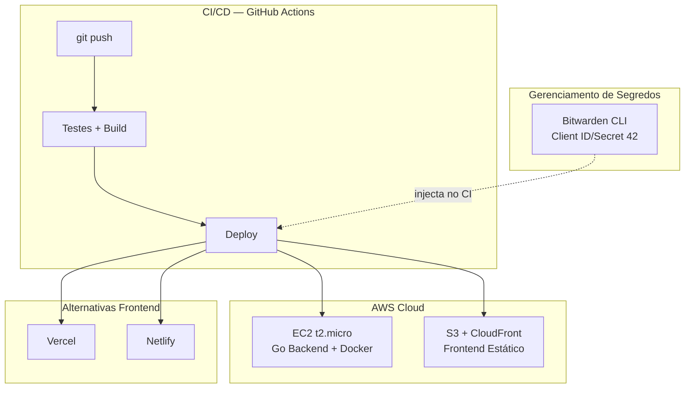
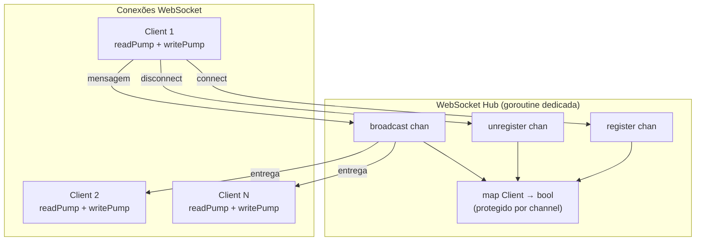

# 42 Chat — Architecture Diagram

> Diagrama gerado a partir da documentação de arquitetura. Renderiza nativamente no Obsidian.

## Fluxo de Autenticação e Conexão

## Arquitetura do Sistema

## Infraestrutura de Deploy

## Fluxo de Mensagens no WebSocket Hub

## Ver Também

- 42 Chat Platform Architecture — Documentação completa da stack
- 42 Chat Engineering Requirements — Requisitos de engenharia
- 42 Chat Design System — Sistema visual
